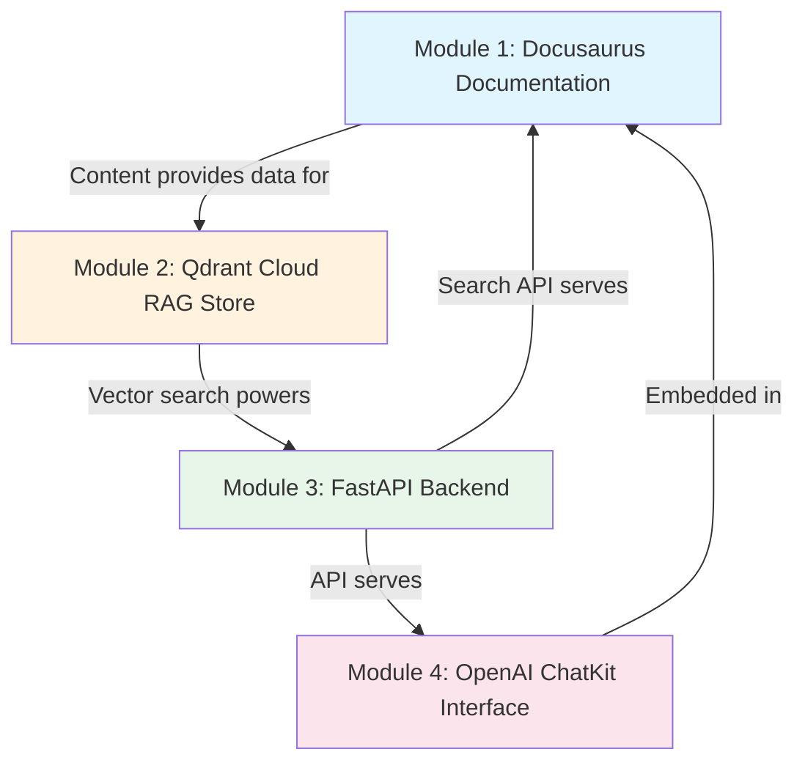

# Implementation Plan: Physical AI & Humanoid Robotics Textbook

**Branch**: `feature/physical-ai-textbook-plan` | **Date**: 2025-12-12 | **Spec**: [specs/physical-ai-textbook/spec.md](./spec.md)
**Input**: Feature specification from `/specs/physical-ai-textbook/spec.md`

---

## Summary

Build a comprehensive Physical AI & Humanoid Robotics textbook using a 4-module architecture:
1. **Docusaurus** - Static site documentation platform for the 28-chapter textbook
2. **Qdrant Cloud** - Vector store for RAG-powered semantic search and content retrieval
3. **FastAPI Backend** - API layer for chatbot interactions and content querying
4. **OpenAI ChatKit** - Agentic AI interface for interactive learning assistance

This plan structures development into milestones with clear dependencies, human review checkpoints, and QA gates.

---

## Technical Context

**Language/Version**:
- Frontend: TypeScript 5.x, React 18.x (Docusaurus)
- Backend: Python 3.11+
- Infrastructure: Docker, Cloud deployment

**Primary Dependencies**:
- Docusaurus v3.x with MDX
- Qdrant Cloud (managed vector database)
- FastAPI 0.100+
- OpenAI API (GPT-4 / ChatKit)
- LangChain for RAG orchestration

**Storage**:
- Qdrant Cloud: Vector embeddings for textbook content
- Static files: MDX content, images, diagrams
- Optional: PostgreSQL for user state/quiz progress

**Testing**:
- Playwright: E2E acceptance tests
- pytest: Backend API tests
- Vitest: Frontend component tests

**Target Platform**: Web (responsive, 375px+ viewport)

**Project Type**: Web application (frontend + backend + vector store)

**Performance Goals**:
- Page load: <3s on 3G connection
- Search results: <500ms response time
- Chatbot response: <5s for RAG-augmented answers

**Constraints**:
- No production code in textbook content (pseudocode only)
- WCAG 2.1 AA accessibility compliance
- All content peer-reviewed before publish

**Scale/Scope**:
- 28 chapters, 200+ glossary terms
- ~500 vector embeddings for RAG
- Support 1000+ concurrent readers

---

## Constitution Check

*GATE: Must pass before Phase 0 research. Re-check after Phase 1 design.*

| Principle | Status | Notes |
|-----------|--------|-------|
| I. Spec-Driven Development | ✅ PASS | Spec created before plan |
| II. No Vibe Coding | ✅ PASS | Plan contains no implementation code |
| III. Embodied Intelligence First | ✅ PASS | Content structure grounds theory in physical context |
| IV. High-Fidelity Simulation Rigor | ✅ PASS | Part IV covers simulation platforms thoroughly |
| V. ROS2 Reliability Standards | ✅ PASS | Part III dedicated to ROS2 patterns |
| VI. Safety-Critical Mindset | ✅ PASS | Safety integrated across all parts |
| VII. Testability and Verification | ✅ PASS | Playwright test specs defined |

---

## Architecture Overview

```
┌─────────────────────────────────────────────────────────────────────┐
│                         USER INTERFACE                               │
├─────────────────────────────────────────────────────────────────────┤
│  ┌─────────────────────────┐    ┌─────────────────────────────────┐ │
│  │    Docusaurus Site      │    │     OpenAI ChatKit Interface    │ │
│  │  - 28 Chapters (MDX)    │    │  - Agentic AI Assistant         │ │
│  │  - Quizzes              │    │  - Context-aware Q&A            │ │
│  │  - Glossary             │    │  - Learning path guidance       │ │
│  │  - Search UI            │    │                                 │ │
│  └───────────┬─────────────┘    └───────────────┬─────────────────┘ │
│              │                                   │                   │
└──────────────┼───────────────────────────────────┼───────────────────┘
               │                                   │
               ▼                                   ▼
┌─────────────────────────────────────────────────────────────────────┐
│                         FASTAPI BACKEND                              │
├─────────────────────────────────────────────────────────────────────┤
│  ┌─────────────────────┐  ┌─────────────────┐  ┌──────────────────┐ │
│  │   /api/search       │  │  /api/chat      │  │  /api/quiz       │ │
│  │   Semantic search   │  │  RAG pipeline   │  │  Assessment API  │ │
│  └─────────┬───────────┘  └────────┬────────┘  └──────────────────┘ │
│            │                       │                                 │
│            ▼                       ▼                                 │
│  ┌─────────────────────────────────────────────────────────────────┐│
│  │                    RAG Orchestration (LangChain)                 ││
│  │  - Query embedding                                               ││
│  │  - Context retrieval                                             ││
│  │  - Response generation                                           ││
│  └─────────────────────────────────────────────────────────────────┘│
└─────────────────────────────────────────────────────────────────────┘
               │                       │
               ▼                       ▼
┌─────────────────────────────┐  ┌─────────────────────────────────────┐
│      QDRANT CLOUD           │  │          OPENAI API                 │
│  - Vector embeddings        │  │  - GPT-4 for generation             │
│  - Semantic similarity      │  │  - Embeddings API                   │
│  - Content chunks           │  │  - ChatKit integration              │
└─────────────────────────────┘  └─────────────────────────────────────┘
```

---

## Project Structure

### Documentation (this feature)

```text
specs/physical-ai-textbook/
├── spec.md              # Feature specification
├── plan.md              # This file
├── tasks.md             # Task breakdown (created by /sp.tasks)
└── contracts/           # API contracts (Phase 1)
    ├── search-api.md
    ├── chat-api.md
    └── quiz-api.md
```

### Source Code (repository root)

```text
my-project/                    # Docusaurus site (Module 1)
├── docs/                      # Textbook content
│   ├── part-i-foundations/
│   │   ├── ch01-embodied-intelligence.mdx
│   │   ├── ch02-physical-ai-principles.mdx
│   │   ├── ch03-robotics-mathematics.mdx
│   │   └── ch04-safety-foundations.mdx
│   ├── part-ii-humanoid-fundamentals/
│   ├── part-iii-ros2/
│   ├── part-iv-simulation/
│   ├── part-v-control/
│   └── part-vi-vla/
├── src/
│   ├── components/
│   │   ├── Quiz/
│   │   ├── GlossaryTerm/
│   │   ├── SafetyCallout/
│   │   ├── PseudocodeBlock/
│   │   └── ChatWidget/        # ChatKit integration
│   └── pages/
├── static/
│   └── diagrams/
├── docusaurus.config.ts
└── sidebars.ts

backend/                       # FastAPI Backend (Module 3)
├── src/
│   ├── api/
│   │   ├── routes/
│   │   │   ├── search.py
│   │   │   ├── chat.py
│   │   │   └── quiz.py
│   │   └── deps.py
│   ├── services/
│   │   ├── rag_service.py
│   │   ├── embedding_service.py
│   │   └── qdrant_client.py
│   ├── models/
│   │   └── schemas.py
│   └── main.py
├── tests/
│   ├── unit/
│   ├── integration/
│   └── contract/
├── requirements.txt
└── Dockerfile

scripts/                       # Content ingestion (Module 2 support)
├── ingest_content.py         # MDX → embeddings → Qdrant
├── generate_glossary.py
└── validate_links.py

e2e/                          # Playwright tests
├── navigation.spec.ts
├── content.spec.ts
├── accessibility.spec.ts
├── search.spec.ts
└── chatbot.spec.ts
```

**Structure Decision**: Web application with Docusaurus frontend, FastAPI backend, and Qdrant vector store. ChatKit embedded in frontend for agentic interactions.

---

## Module Dependencies



**Critical Path**: M1 (content) → M2 (ingestion) → M3 (API) → M4 (chat integration)

---

## Milestones

### Phase 0: Foundation Setup

| Milestone | Deliverables | Dependencies | Human Review |
|-----------|--------------|--------------|--------------|
| **M0.1** Project Scaffolding | Docusaurus initialized, backend skeleton, CI/CD pipeline | None | ✅ Architecture approval |
| **M0.2** Infrastructure Setup | Qdrant Cloud provisioned, OpenAI API configured, environment variables | M0.1 | ✅ Security review |

**Exit Criteria**:
- [ ] Docusaurus dev server runs locally
- [ ] FastAPI health endpoint responds
- [ ] Qdrant Cloud connection verified
- [ ] OpenAI API key validated
- [ ] CI pipeline executes on push

---

### Phase 1: Module 1 - Docusaurus Documentation

| Milestone | Deliverables | Dependencies | Human Review |
|-----------|--------------|--------------|--------------|
| **M1.1** Site Structure | Navigation, sidebars, part/chapter hierarchy | M0.1 | ✅ Information architecture review |
| **M1.2** Core Components | Quiz, GlossaryTerm, SafetyCallout, PseudocodeBlock components | M1.1 | ✅ UX review |
| **M1.3** Part I Content | Chapters 1-4 (Foundations) complete | M1.2 | ✅ Technical accuracy review |
| **M1.4** Part II Content | Chapters 5-8 (Humanoid Fundamentals) | M1.3 | ✅ Technical accuracy review |
| **M1.5** Part III Content | Chapters 9-13 (ROS2) | M1.4 | ✅ Technical accuracy review |
| **M1.6** Part IV Content | Chapters 14-18 (Simulation) | M1.5 | ✅ Technical accuracy review |
| **M1.7** Part V Content | Chapters 19-23 (Control) | M1.6 | ✅ Technical accuracy review |
| **M1.8** Part VI Content | Chapters 24-28 (VLA) | M1.7 | ✅ Technical accuracy review |
| **M1.9** Glossary & Index | 200+ terms, cross-references | M1.8 | ✅ Completeness review |

**Exit Criteria per Content Milestone**:
- [ ] All chapters have learning objectives
- [ ] All chapters have self-assessment quiz
- [ ] All pseudocode blocks have disclaimers
- [ ] Safety callouts present (minimum 3 per part)
- [ ] Diagrams render correctly
- [ ] No broken internal links

---

### Phase 2: Module 2 - Qdrant Cloud RAG Store

| Milestone | Deliverables | Dependencies | Human Review |
|-----------|--------------|--------------|--------------|
| **M2.1** Ingestion Pipeline | Script to chunk MDX, generate embeddings, upload to Qdrant | M1.3 (min Part I content) | ✅ Data architecture review |
| **M2.2** Collection Schema | Qdrant collection with metadata (chapter, part, keywords) | M2.1 | ✅ Schema review |
| **M2.3** Full Content Ingestion | All 28 chapters indexed | M1.9 | ✅ Coverage verification |

**Exit Criteria**:
- [ ] All chapters chunked and embedded
- [ ] Semantic search returns relevant chunks
- [ ] Metadata enables filtering by part/chapter
- [ ] ~500 vectors indexed with <100ms query time

---

### Phase 3: Module 3 - FastAPI Backend

| Milestone | Deliverables | Dependencies | Human Review |
|-----------|--------------|--------------|--------------|
| **M3.1** API Scaffolding | FastAPI app, health checks, CORS, OpenAPI docs | M0.1 | ✅ API design review |
| **M3.2** Search Endpoint | `/api/search` with Qdrant integration | M2.2 | ✅ Contract review |
| **M3.3** RAG Pipeline | LangChain orchestration, context retrieval, response generation | M3.2 | ✅ RAG quality review |
| **M3.4** Chat Endpoint | `/api/chat` with conversation history | M3.3 | ✅ Contract review |
| **M3.5** Quiz Endpoint | `/api/quiz` for assessment submission (optional) | M3.1 | ✅ Contract review |

**Exit Criteria**:
- [ ] All endpoints documented in OpenAPI
- [ ] Search returns results in <500ms
- [ ] Chat provides context-aware responses
- [ ] Rate limiting configured
- [ ] Error handling standardized

---

### Phase 4: Module 4 - OpenAI ChatKit Interface

| Milestone | Deliverables | Dependencies | Human Review |
|-----------|--------------|--------------|--------------|
| **M4.1** ChatKit Integration | ChatWidget component embedded in Docusaurus | M3.4 | ✅ UX review |
| **M4.2** Agentic Behaviors | Learning path suggestions, concept explanations, quiz help | M4.1 | ✅ Pedagogy review |
| **M4.3** Context Awareness | Chat knows current chapter, suggests related content | M4.2 | ✅ Quality review |

**Exit Criteria**:
- [ ] Chat widget accessible on all pages
- [ ] Responses cite source chapters
- [ ] Agent suggests relevant next topics
- [ ] Conversation history persists per session

---

### Phase 5: QA & Launch

| Milestone | Deliverables | Dependencies | Human Review |
|-----------|--------------|--------------|--------------|
| **M5.1** Playwright Test Suite | All acceptance tests from spec implemented | M4.3 | ✅ Test coverage review |
| **M5.2** Accessibility Audit | WCAG 2.1 AA compliance verified | M5.1 | ✅ Accessibility sign-off |
| **M5.3** Performance Optimization | Lighthouse score ≥90, load time <3s | M5.2 | ✅ Performance sign-off |
| **M5.4** Security Review | API authentication, rate limiting, input validation | M5.3 | ✅ Security sign-off |
| **M5.5** Production Deployment | Site live, monitoring enabled | M5.4 | ✅ Launch approval |

**Exit Criteria**:
- [ ] All Playwright tests pass
- [ ] Lighthouse accessibility ≥90
- [ ] Lighthouse performance ≥90
- [ ] No critical security findings
- [ ] Monitoring dashboards configured

---

## Documentation Milestones (Docusaurus)

| Milestone | Content | Review Gate |
|-----------|---------|-------------|
| **DOC-1** | Part I: Foundations (4 chapters) | Domain expert review |
| **DOC-2** | Part II: Humanoid Fundamentals (4 chapters) | Domain expert review |
| **DOC-3** | Part III: ROS2 (5 chapters) | ROS2 specialist review |
| **DOC-4** | Part IV: Simulation (5 chapters) | Platform expert review |
| **DOC-5** | Part V: Control (5 chapters) | Control systems expert review |
| **DOC-6** | Part VI: VLA (5 chapters) | ML/AI researcher review |
| **DOC-7** | Glossary (200+ terms) | Technical editor review |
| **DOC-8** | Index & Cross-references | QA verification |

---

## QA Milestones (Playwright Test-Spec)

| Milestone | Test Categories | Pass Criteria |
|-----------|-----------------|---------------|
| **QA-1** | Navigation tests (NAV-001 to NAV-005) | All 5 tests pass |
| **QA-2** | Content tests (CON-001 to CON-005) | All 5 tests pass |
| **QA-3** | Accessibility tests (A11Y-001 to A11Y-005) | All 5 tests pass |
| **QA-4** | Cross-reference tests (XREF-001 to XREF-004) | All 4 tests pass |
| **QA-5** | Search & Chat integration tests | All integration tests pass |

---

## Review & Approval Checkpoints

```
Phase 0 ──► [✅ ARCHITECTURE APPROVAL] ──► Phase 1
                                              │
Phase 1 ──► [✅ CONTENT REVIEW per Part] ────►│
                                              │
Phase 2 ──► [✅ DATA ARCHITECTURE REVIEW] ───►│
                                              │
Phase 3 ──► [✅ API CONTRACT REVIEW] ─────────┤
                                              │
Phase 4 ──► [✅ UX & PEDAGOGY REVIEW] ────────┤
                                              │
Phase 5 ──► [✅ QA SIGN-OFF] ─────────────────┤
        ──► [✅ SECURITY SIGN-OFF] ───────────┤
        ──► [✅ ACCESSIBILITY SIGN-OFF] ──────┤
        ──► [✅ LAUNCH APPROVAL] ─────────────► PRODUCTION
```

---

## Human Review Points Summary

| Checkpoint | Reviewer Role | Blocking? |
|------------|---------------|-----------|
| Architecture Approval | Content Architect | Yes |
| Security Review | Security Engineer | Yes |
| Information Architecture | UX Designer | Yes |
| Technical Accuracy (per Part) | Domain Expert | Yes |
| API Contract Review | Backend Lead | Yes |
| RAG Quality Review | ML Engineer | Yes |
| Pedagogy Review | Education Specialist | Yes |
| Accessibility Sign-off | Accessibility Specialist | Yes |
| Launch Approval | Project Stakeholder | Yes |

---

## Risk Analysis

| Risk | Impact | Mitigation |
|------|--------|------------|
| Content accuracy errors | High | Domain expert review per chapter |
| RAG hallucination | Medium | Citation requirements, source verification |
| Platform documentation drift | Medium | Version pinning, quarterly review cadence |
| OpenAI API rate limits | Medium | Caching, fallback responses |
| Accessibility failures | High | Early Lighthouse audits, continuous testing |

---

## Open Decisions (Require ADR)

📋 **Architectural decision detected**: Vector embedding model selection (OpenAI ada-002 vs open-source alternatives)
Document reasoning and tradeoffs? Run `/sp.adr embedding-model-selection`

📋 **Architectural decision detected**: RAG chunking strategy (fixed-size vs semantic)
Document reasoning and tradeoffs? Run `/sp.adr rag-chunking-strategy`

📋 **Architectural decision detected**: Chat history persistence (session vs database)
Document reasoning and tradeoffs? Run `/sp.adr chat-history-persistence`

---

## Complexity Tracking

> No constitution violations requiring justification.

---

**Plan Version**: 1.0.0 | **Author**: Claude Code Agent | **Reviewed**: Pending Human Approval
