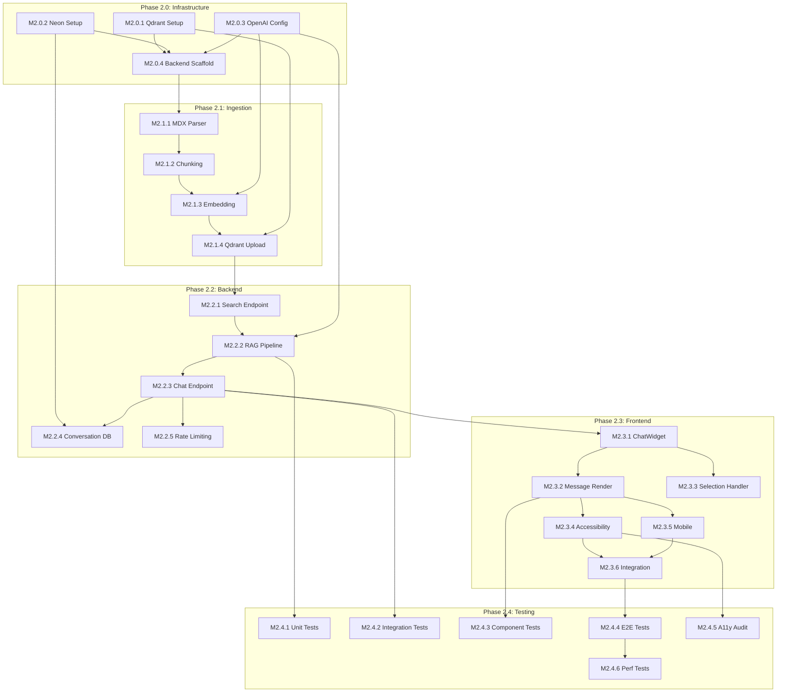

# Implementation Plan: RAG Chatbot for Physical AI Textbook

**Branch**: `feature/rag-chatbot` | **Date**: 2025-12-12 | **Spec**: [specs/rag-chatbot/spec.md](./spec.md)
**Phase**: 2 (Follows Phase 1: Docusaurus Site Completion)
**Input**: Feature specification from `/specs/rag-chatbot/spec.md`

---

## Summary

Implement an embedded RAG (Retrieval-Augmented Generation) chatbot for the Physical AI & Humanoid Robotics Docusaurus textbook. The chatbot enables readers to ask questions about textbook content and get contextual explanations of selected text passages, with all responses grounded in actual book content via vector similarity search.

**Key Architecture Decisions**:
- Qdrant Cloud Free Tier for vector storage (1GB, 1M vectors)
- Neon Serverless Postgres for conversation history and analytics
- FastAPI backend with LangChain RAG orchestration
- OpenAI GPT-4 for generation, ada-002 for embeddings
- React ChatWidget component embedded in Docusaurus

---

## Technical Context

**Language/Version**:
- Backend: Python 3.11+
- Frontend: TypeScript 5.x, React 18.x (Docusaurus MDX)
- Database: SQL (PostgreSQL dialect)

**Primary Dependencies**:
- FastAPI 0.109+
- LangChain 0.1+
- OpenAI Python SDK 1.0+
- Qdrant Client 1.7+
- Psycopg3 (Neon Postgres driver)
- Pydantic 2.0+ (request/response validation)

**Storage**:
- Qdrant Cloud: ~500 vectors (textbook chunks, 1536 dimensions)
- Neon Postgres: Conversations, chat history, usage metrics

**Testing**:
- pytest: Backend API and RAG pipeline tests
- Playwright: E2E chatbot interaction tests
- Vitest: Frontend component tests

**Target Platform**: Web (Docusaurus site, responsive 375px+)

**Project Type**: Web application (React frontend + FastAPI backend + vector/SQL storage)

**Performance Goals**:
- Chat response: <5s p95 latency
- Search results: <500ms
- Widget load: <1s after page load

**Constraints**:
- Qdrant Free Tier: 1GB storage, 1M vectors max
- Neon Free Tier: 512MB storage, 3GB transfer/month
- OpenAI Rate Limits: 3500 RPM (GPT-4), 1M TPM
- No PII storage
- WCAG 2.1 AA compliance

**Scale/Scope**:
- ~500 vector embeddings (28 chapters chunked)
- ~1000 concurrent readers
- ~100 daily active chatbot users (estimated)

---

## Constitution Check

*GATE: Must pass before Phase 0 research. Re-check after Phase 1 design.*

| Principle | Status | Notes |
|-----------|--------|-------|
| I. Spec-Driven Development | PASS | Spec created at `specs/rag-chatbot/spec.md` |
| II. No Vibe Coding | PASS | Plan contains no implementation code; pseudocode only |
| III. Embodied Intelligence First | N/A | Infrastructure feature, not content |
| IV. High-Fidelity Simulation Rigor | N/A | Infrastructure feature, not content |
| V. ROS2 Reliability Standards | N/A | Infrastructure feature, not content |
| VI. Safety-Critical Mindset | PASS | Security considerations documented; no PII |
| VII. Testability and Verification | PASS | Test specs defined; Playwright + pytest |

---

## Architecture Overview

```
                              PHASE 2: RAG CHATBOT ARCHITECTURE
                              ==================================

┌─────────────────────────────────────────────────────────────────────────────┐
│                          DOCUSAURUS FRONTEND                                 │
│                                                                              │
│  ┌──────────────────────────────────────────────────────────────────────┐   │
│  │                      ChatWidget Component                             │   │
│  │  ┌─────────────┐  ┌──────────────┐  ┌────────────────────────────┐   │   │
│  │  │ Chat Input  │  │ Message List │  │ Selection Context Handler  │   │   │
│  │  └─────────────┘  └──────────────┘  └────────────────────────────┘   │   │
│  │                                                                        │   │
│  │  State: conversation[], selectedText, isLoading, sessionId            │   │
│  └───────────────────────────────────────────────────────────────────────┘   │
│                                      │                                        │
└──────────────────────────────────────┼────────────────────────────────────────┘
                                       │
                          POST /api/chat │ GET /api/search
                                       ▼
┌─────────────────────────────────────────────────────────────────────────────┐
│                           FASTAPI BACKEND                                    │
│                                                                              │
│  ┌─────────────────────────────────────────────────────────────────────┐    │
│  │                         API Routes Layer                             │    │
│  │  ┌──────────────┐  ┌────────────────┐  ┌──────────────────────────┐ │    │
│  │  │ /api/chat    │  │ /api/search    │  │ /api/health             │ │    │
│  │  │ POST         │  │ GET            │  │ GET                     │ │    │
│  │  └──────┬───────┘  └───────┬────────┘  └──────────────────────────┘ │    │
│  └─────────┼──────────────────┼───────────────────────────────────────-┘    │
│            │                  │                                              │
│  ┌─────────▼──────────────────▼────────────────────────────────────────┐    │
│  │                       Services Layer                                 │    │
│  │  ┌────────────────────┐  ┌─────────────────────┐  ┌──────────────┐  │    │
│  │  │  RAGService        │  │  EmbeddingService   │  │ ConvoService │  │    │
│  │  │  - retrieve()      │  │  - embed_query()    │  │ - load()     │  │    │
│  │  │  - generate()      │  │  - embed_chunks()   │  │ - save()     │  │    │
│  │  │  - format_response│  │                     │  │ - prune()    │  │    │
│  │  └─────────┬──────────┘  └──────────┬──────────┘  └──────┬───────┘  │    │
│  └────────────┼─────────────────────────┼───────────────────┼──────────┘    │
│               │                         │                   │                │
└───────────────┼─────────────────────────┼───────────────────┼────────────────┘
                │                         │                   │
        ┌───────┴───────┐         ┌───────┴───────┐   ┌───────┴───────┐
        ▼               ▼         ▼               ▼   ▼               ▼
┌───────────────┐ ┌───────────────┐ ┌───────────────┐ ┌───────────────┐
│  QDRANT CLOUD │ │   OPENAI API  │ │   OPENAI API  │ │ NEON POSTGRES │
│               │ │  (GPT-4)      │ │  (ada-002)    │ │               │
│ - Collections │ │               │ │               │ │ - conversations│
│ - Vectors     │ │ - Chat        │ │ - Embeddings  │ │ - messages    │
│ - Search      │ │   Completion  │ │   API         │ │ - analytics   │
└───────────────┘ └───────────────┘ └───────────────┘ └───────────────┘
```

---

## Project Structure

### Documentation (this feature)

```text
specs/rag-chatbot/
├── spec.md                    # Feature specification (created)
├── plan.md                    # This file
├── tasks.md                   # Task breakdown (created by /sp.tasks)
├── implement/
│   └── rag-chatbot.implement.md  # Implementation narrative
└── contracts/
    ├── chat-api.contract.md   # POST /api/chat contract
    ├── search-api.contract.md # GET /api/search contract
    └── health-api.contract.md # GET /api/health contract
```

### Source Code (repository root)

```text
# Frontend (Docusaurus)
my-project/
├── src/
│   ├── components/
│   │   └── ChatWidget/
│   │       ├── ChatWidget.tsx         # Main chat component
│   │       ├── ChatWidget.module.css  # Scoped styles
│   │       ├── MessageList.tsx        # Conversation renderer
│   │       ├── ChatInput.tsx          # Query input with submit
│   │       ├── Citation.tsx           # Clickable source links
│   │       ├── SelectionHandler.tsx   # Text selection detection
│   │       └── index.ts               # Public exports
│   └── theme/
│       └── Root.tsx                   # ChatWidget provider wrapper
├── static/
│   └── icons/
│       └── chat-icon.svg
└── docusaurus.config.ts               # Add chatbot env vars

# Backend (FastAPI)
backend/
├── src/
│   ├── api/
│   │   ├── __init__.py
│   │   ├── routes/
│   │   │   ├── __init__.py
│   │   │   ├── chat.py                # POST /api/chat
│   │   │   ├── search.py              # GET /api/search
│   │   │   └── health.py              # GET /api/health
│   │   └── deps.py                    # FastAPI dependencies
│   ├── services/
│   │   ├── __init__.py
│   │   ├── rag_service.py             # RAG pipeline orchestration
│   │   ├── embedding_service.py       # OpenAI embedding calls
│   │   ├── qdrant_service.py          # Vector store operations
│   │   ├── conversation_service.py    # Chat history management
│   │   └── openai_service.py          # GPT-4 completion calls
│   ├── models/
│   │   ├── __init__.py
│   │   ├── schemas.py                 # Pydantic request/response
│   │   └── database.py                # SQLAlchemy/Neon models
│   ├── core/
│   │   ├── __init__.py
│   │   ├── config.py                  # Environment configuration
│   │   └── prompts.py                 # System prompts templates
│   └── main.py                        # FastAPI app factory
├── tests/
│   ├── unit/
│   │   ├── test_rag_service.py
│   │   └── test_embedding_service.py
│   ├── integration/
│   │   ├── test_chat_endpoint.py
│   │   └── test_search_endpoint.py
│   └── conftest.py                    # pytest fixtures
├── scripts/
│   ├── ingest_content.py              # MDX -> vectors pipeline
│   ├── setup_qdrant.py                # Collection initialization
│   └── setup_neon.py                  # Database migrations
├── requirements.txt
├── requirements-dev.txt
└── Dockerfile

# E2E Tests (Playwright)
e2e/
├── chatbot/
│   ├── chat-basic.spec.ts             # Basic Q&A tests
│   ├── chat-selection.spec.ts         # Selected text tests
│   ├── chat-accessibility.spec.ts     # A11y tests
│   └── chat-mobile.spec.ts            # Responsive tests
└── playwright.config.ts
```

**Structure Decision**: Monorepo with Docusaurus frontend (`my-project/`) and FastAPI backend (`backend/`). Shared E2E tests in `e2e/`. Ingestion scripts in `backend/scripts/`.

---

## Module Breakdown

### Module A: Content Ingestion Pipeline

**Purpose**: Transform MDX textbook content into vector embeddings stored in Qdrant

**Components**:
1. MDX Parser: Extract text content from MDX files
2. Chunker: Split content into ~500 token chunks with overlap
3. Metadata Extractor: Capture chapter, section, page URL
4. Embedding Generator: Call OpenAI ada-002 for vectors
5. Qdrant Loader: Upsert vectors with metadata

**Data Flow**:
```
docs/**/*.mdx → Parse → Chunk → Embed → Qdrant Collection
```

---

### Module B: FastAPI Backend

**Purpose**: Serve RAG-powered chat and search APIs

**Components**:
1. Chat Route: Accept queries, orchestrate RAG, return responses
2. Search Route: Direct vector similarity search
3. RAG Service: Query embedding → retrieval → generation
4. Conversation Service: Load/save chat history from Neon
5. Health Route: Service dependency status

---

### Module C: React ChatWidget

**Purpose**: Embedded UI for chat interactions

**Components**:
1. ChatWidget: Container component with state management
2. MessageList: Render conversation history
3. ChatInput: Query input with send button
4. Citation: Clickable links to source chapters
5. SelectionHandler: Detect text selection, trigger contextual chat

---

### Module D: Infrastructure Setup

**Purpose**: Provision and configure external services

**Components**:
1. Qdrant Cloud: Create collection, configure index
2. Neon Postgres: Create database, run migrations
3. Environment Variables: API keys, connection strings
4. CORS Configuration: Restrict to textbook domain

---

## Milestones

### Phase 2.0: Infrastructure Setup

| Milestone | Deliverables | Dependencies | Human Review |
|-----------|--------------|--------------|--------------|
| **M2.0.1** Qdrant Cloud Setup | Collection created, schema defined | None | Config review |
| **M2.0.2** Neon Postgres Setup | Database created, tables migrated | None | Schema review |
| **M2.0.3** OpenAI Configuration | API keys configured, rate limits tested | None | Security review |
| **M2.0.4** Backend Scaffolding | FastAPI app with health endpoint | M2.0.1-3 | Architecture review |

**Exit Criteria**:
- [ ] Qdrant collection `textbook_chunks` created
- [ ] Neon tables `conversations`, `messages`, `analytics` created
- [ ] OpenAI API key validated with test embedding call
- [ ] FastAPI `/api/health` returns all services connected
- [ ] Environment variables documented and secured

---

### Phase 2.1: Content Ingestion

| Milestone | Deliverables | Dependencies | Human Review |
|-----------|--------------|--------------|--------------|
| **M2.1.1** MDX Parser | Script to extract text from MDX files | Phase 1 content | Output review |
| **M2.1.2** Chunking Strategy | Semantic chunking with 500 token max | M2.1.1 | Chunk quality review |
| **M2.1.3** Embedding Pipeline | Batch embedding with progress tracking | M2.1.2, M2.0.3 | Cost estimation |
| **M2.1.4** Qdrant Upload | All chunks indexed with metadata | M2.1.3, M2.0.1 | Coverage verification |

**Exit Criteria**:
- [ ] All 28 chapters parsed successfully
- [ ] ~500 chunks created with appropriate overlap
- [ ] All chunks embedded (1536-dim vectors)
- [ ] Metadata includes chapter_id, section_id, url, title
- [ ] Test search returns relevant results

---

### Phase 2.2: Backend API Development

| Milestone | Deliverables | Dependencies | Human Review |
|-----------|--------------|--------------|--------------|
| **M2.2.1** Search Endpoint | GET /api/search with Qdrant query | M2.1.4 | Contract review |
| **M2.2.2** RAG Pipeline | LangChain retrieval + generation chain | M2.2.1, M2.0.3 | Quality review |
| **M2.2.3** Chat Endpoint | POST /api/chat with context handling | M2.2.2 | Contract review |
| **M2.2.4** Conversation Persistence | Load/save history to Neon | M2.0.2, M2.2.3 | Data flow review |
| **M2.2.5** Rate Limiting | Per-session rate limits implemented | M2.2.3 | Security review |

**Exit Criteria**:
- [ ] Search returns top-k relevant chunks in <500ms
- [ ] Chat generates grounded responses with citations
- [ ] Off-topic queries detected and refused
- [ ] Conversation history persists across requests
- [ ] Rate limiting prevents abuse (30 req/min/session)

---

### Phase 2.3: Frontend Chat Widget

| Milestone | Deliverables | Dependencies | Human Review |
|-----------|--------------|--------------|--------------|
| **M2.3.1** ChatWidget Component | Basic chat UI with input/submit | M2.2.3 | UX review |
| **M2.3.2** Message Rendering | Display conversation with citations | M2.3.1 | UX review |
| **M2.3.3** Text Selection Handler | Detect selection, add context | M2.3.1 | UX review |
| **M2.3.4** Accessibility | Keyboard nav, ARIA, focus management | M2.3.2 | A11y audit |
| **M2.3.5** Mobile Responsive | Full-screen modal on mobile | M2.3.2 | Responsive review |
| **M2.3.6** Docusaurus Integration | Widget mounted on all /docs/* pages | M2.3.1-5 | Integration review |

**Exit Criteria**:
- [ ] Chat widget visible on all doc pages
- [ ] Conversations render correctly with citations
- [ ] Text selection triggers contextual chat
- [ ] Keyboard-only navigation works completely
- [ ] Mobile UI usable on 375px viewport
- [ ] Widget loads in <1s after page load

---

### Phase 2.4: Testing & QA

| Milestone | Deliverables | Dependencies | Human Review |
|-----------|--------------|--------------|--------------|
| **M2.4.1** Backend Unit Tests | pytest coverage for services | M2.2.* | Coverage review |
| **M2.4.2** API Integration Tests | Endpoint contract tests | M2.2.* | Test review |
| **M2.4.3** Frontend Component Tests | Vitest for ChatWidget | M2.3.* | Test review |
| **M2.4.4** E2E Playwright Tests | Full chatbot interaction tests | M2.3.6 | Test review |
| **M2.4.5** Accessibility Audit | WCAG 2.1 AA verification | M2.3.4 | A11y sign-off |
| **M2.4.6** Performance Testing | Latency benchmarks | M2.4.4 | Performance sign-off |

**Exit Criteria**:
- [ ] Backend test coverage >80%
- [ ] All API contract tests pass
- [ ] All Playwright test specs pass
- [ ] Accessibility audit: 0 critical issues
- [ ] p95 latency <5s for chat responses

---

### Phase 2.5: Deployment & Launch

| Milestone | Deliverables | Dependencies | Human Review |
|-----------|--------------|--------------|--------------|
| **M2.5.1** Backend Deployment | FastAPI deployed to production | M2.4.* | Deployment review |
| **M2.5.2** Frontend Deployment | Docusaurus build with ChatWidget | M2.4.* | Deployment review |
| **M2.5.3** Monitoring Setup | Error tracking, latency dashboards | M2.5.1-2 | Ops review |
| **M2.5.4** Documentation | API docs, runbook, troubleshooting | M2.5.* | Doc review |
| **M2.5.5** Launch | Chatbot live on production site | M2.5.1-4 | Launch approval |

**Exit Criteria**:
- [ ] Backend healthy in production
- [ ] Frontend deployed with chatbot functional
- [ ] Error alerting configured
- [ ] Runbook documented for common issues
- [ ] Launch announcement ready

---

## Dependency Graph



---

## Human Review Checkpoints

| Checkpoint | Reviewer Role | Blocking? | Phase |
|------------|---------------|-----------|-------|
| Infrastructure Config | DevOps/Security | Yes | 2.0 |
| Qdrant Schema | Data Engineer | Yes | 2.0 |
| Neon Schema | Data Engineer | Yes | 2.0 |
| Chunk Quality | Content Expert | Yes | 2.1 |
| API Contracts | Backend Lead | Yes | 2.2 |
| RAG Response Quality | ML Engineer | Yes | 2.2 |
| UX/UI Design | UX Designer | Yes | 2.3 |
| Accessibility | A11y Specialist | Yes | 2.3 |
| Test Coverage | QA Lead | Yes | 2.4 |
| Launch Readiness | Project Lead | Yes | 2.5 |

---

## Risk Analysis

| Risk | Probability | Impact | Mitigation |
|------|-------------|--------|------------|
| RAG hallucination | Medium | High | Strict system prompts, citation validation |
| OpenAI rate limits | Medium | Medium | Request queuing, caching, fallback responses |
| Qdrant free tier limits | Low | Medium | Monitor usage, upgrade path documented |
| Neon free tier limits | Low | Medium | Prune old conversations, monitor storage |
| Poor chunk quality | Medium | High | Manual chunk review, iterative refinement |
| Slow response times | Medium | Medium | Optimize prompts, parallel retrieval |
| Prompt injection | Low | High | Input sanitization, hardened system prompts |

---

## Open Decisions (Require ADR)

**Architectural decision detected**: Embedding model selection
- OpenAI ada-002 (managed, consistent) vs open-source (cost savings, privacy)
- Document reasoning and tradeoffs? Run `/sp.adr embedding-model-selection`

**Architectural decision detected**: Chunking strategy
- Fixed-size (500 tokens) vs semantic (sentence/paragraph boundaries)
- Document reasoning and tradeoffs? Run `/sp.adr chunking-strategy`

**Architectural decision detected**: Conversation storage duration
- 30-day retention vs indefinite vs no storage
- Document reasoning and tradeoffs? Run `/sp.adr conversation-retention`

**Architectural decision detected**: Rate limiting approach
- Per-session vs per-IP vs token-based
- Document reasoning and tradeoffs? Run `/sp.adr rate-limiting-strategy`

---

## Complexity Tracking

> No constitution violations requiring justification.

| Complexity Factor | Justification |
|-------------------|---------------|
| 3 external services (Qdrant, Neon, OpenAI) | Each serves distinct purpose; no viable single-service alternative |
| LangChain abstraction | Provides tested RAG patterns; simpler than raw implementation |
| React component in Docusaurus | Standard pattern for interactive features in static sites |

---

**Plan Version**: 1.0.0 | **Author**: Claude Code Agent | **Reviewed**: Pending Human Approval
